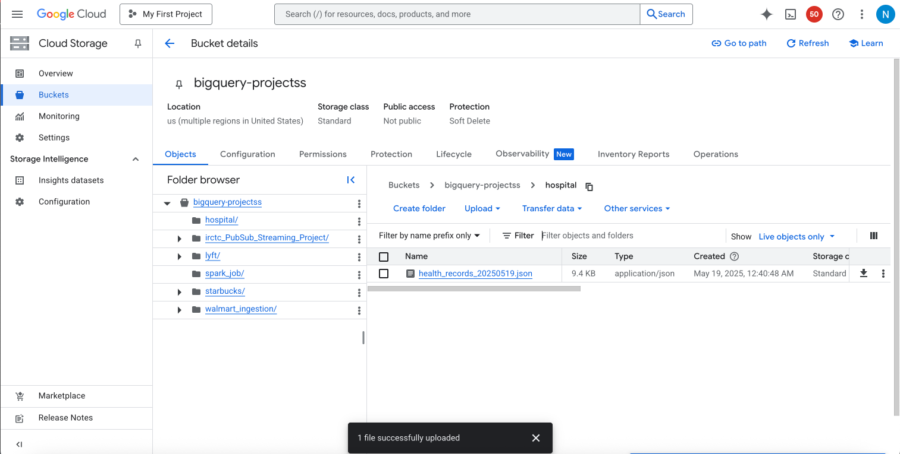
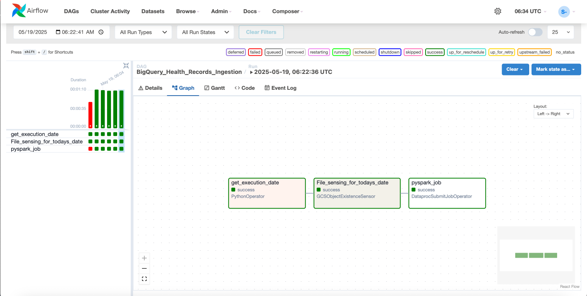
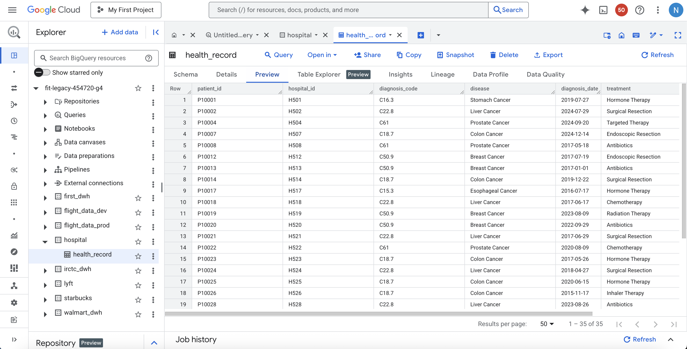

# BigQuery Health Records Ingestion Pipeline

This project demonstrates a GCP-based data ingestion pipeline for processing hospital health records using **Apache Airflow**, **Apache Spark on Dataproc**, and **Google BigQuery**.

## Project Overview

The pipeline performs the following steps:

1. **File Sensor Task** – Monitors a GCS bucket for new JSON files.
2. **Spark Job** – Reads the ingested JSON file, filters records related to cancer diagnoses (ICD codes starting with 'C'), and writes the cleaned data to a BigQuery table.
3. **BigQuery Sink** – Stores the transformed data for analytics and reporting.

---

## Data Flow

### 📂 GCS Bucket File Upload
Once a new file is uploaded to the bucket, the Airflow DAG triggers the Spark ingestion job.

---

### ⚙️ Apache Airflow DAG
This DAG contains three tasks:
- `get_execution_date`
- `File_sensing_for_todays_date`
- `pyspark_job`

All tasks completed successfully after correct file structure and path were ensured.

---

### 🧠 BigQuery Table
Transformed health records with cancer diagnosis codes are appended to the `hospital.health_record` table.

---

## Key Technologies

- **Apache Airflow**
- **Google Cloud Composer**
- **Google Cloud Storage (GCS)**
- **Apache Spark (Dataproc)**
- **Google BigQuery**
- **PySpark**

---

## Notes

- Ensure uploaded JSON is newline-delimited for correct parsing with Spark (`multiLine=false`).
- Spark reads the JSON, applies filters, and writes the data using the BigQuery Connector with `direct` write method.

## Author

__Niranjana Subramanian__
